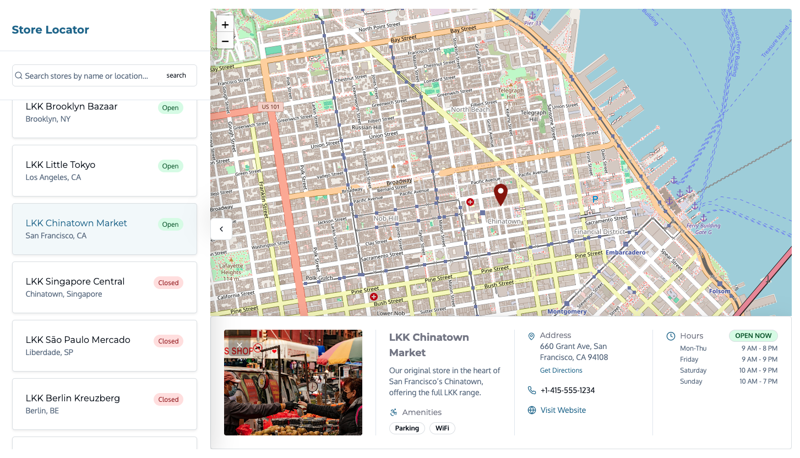

# Jahia Store Locator

The **Jahia Store Locator** module provides a fully configurable and translatable content structure for managing physical store locations with geolocation, address, opening hours, and search capability.

The webapp is developed in Type Script and embedded in a Jahia OSGI module.

The webapp is available here : https://github.com/smonier/store-locator-webapp

## ✨ Features

- Custom content types for stores (`slocnt:store`)
- Mixins for address and geo-location (`slocmix:address`, `slocmix:geo`)
- Multi-language support
- Content override for opening hours, custom react selector type
- Support for amenity listing, image, contact, and web links
- Ready for GraphQL querying
- Includes UI field labels and tooltips in English and French

## ⚙️ Usage

1. Deploy the module in your Jahia environment
2. Add `slocnt:store` content types to your content tree
3. Add `slocnt:storeLocatorApp` to one of your page

## Screenshot




## 🗺️ Example GraphQL Query

```graphql
query GetStores($workspace: Workspace!, $language: String!, $path: String!) {
    jcr(workspace: $workspace) {
        nodesByCriteria(criteria: {nodeType: "slocnt:store", paths: [$path]}) {
            nodes {
                uuid
                displayName(language: $language)
                name: property(name: "name", language: $language) {
                    value
                }
                description: property(name: "description", language: $language) {
                    value
                }
                image: property(name: "image") {
                    node: refNode {
                        url
                    }
                }
                telephone: property(name: "telephone", language: $language) {
                    value
                }
                priceRange: property(name: "priceRange", language: $language) {
                    value
                }
                amenityFeature: property(name: "amenityFeature", language: $language) {
                    values
                }
                openingHours: property(name: "openingHours", language: $language) {
                    values
                }
                latitude: property(name: "latitude", language: $language) {
                    value
                }
                longitude: property(name: "longitude", language: $language) {
                    value
                }
                streetAddress: property(name: "streetAddress", language: $language) {
                    value
                }
                addressLocality: property(name: "addressLocality", language: $language) {
                    value
                }
                addressRegion: property(name: "addressRegion", language: $language) {
                    value
                }
                postalCode: property(name: "postalCode", language: $language) {
                    value
                }
                addressCountry: property(name: "addressCountry", language: $language) {
                    value
                }
                url: property(name: "url", language: $language) {
                    value
                }
            }
        }
    }
}
```

## 📞 Support

For improvements or contributions, feel free to submit issues or pull requests on the repository.
